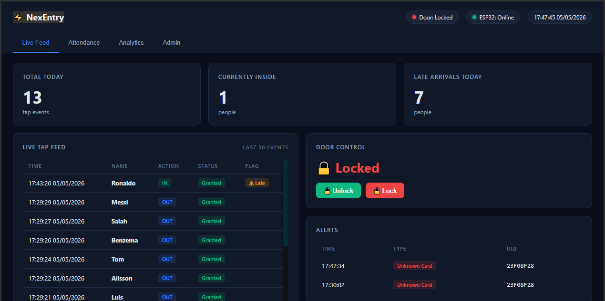
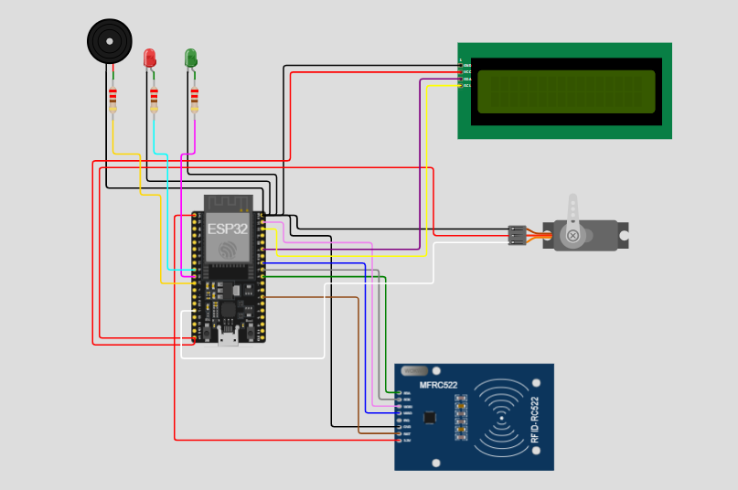
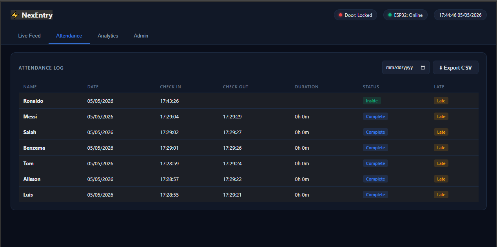
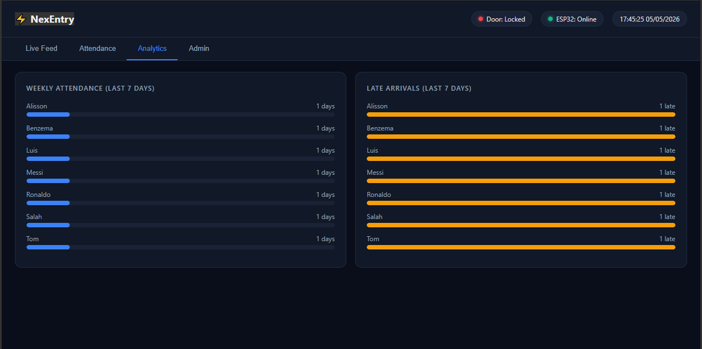
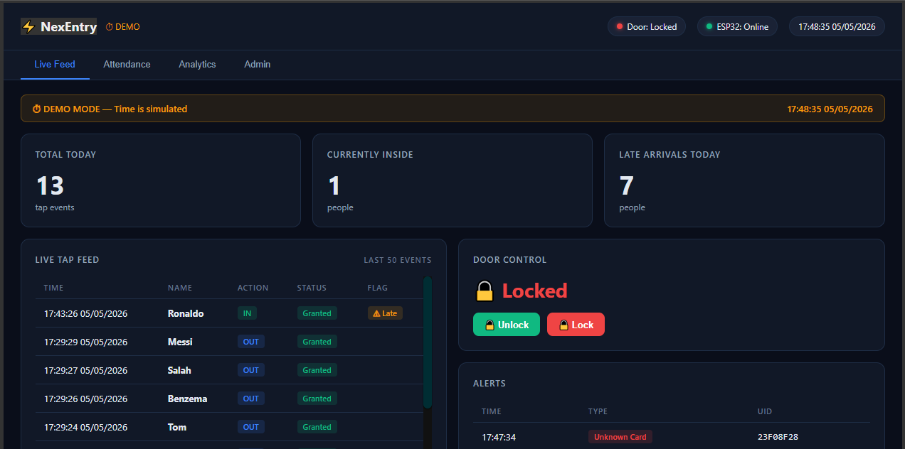
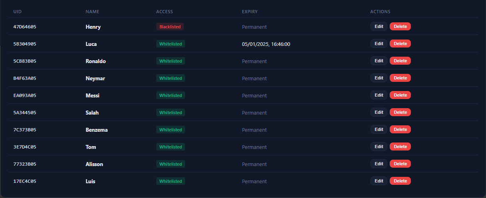
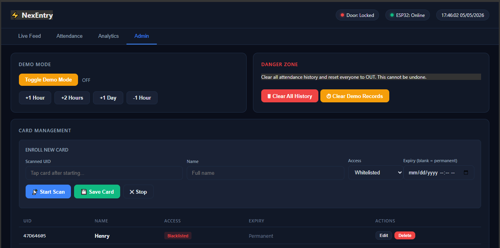

# ⚡ NexEntry
### RFID Access Control & Presence Management System

> A production-grade IoT access control system built on ESP32 and Raspberry Pi, featuring real-time attendance tracking, a live analytics dashboard, multi-layer admin security, and a full demo mode for showcasing.



---

## 📌 Overview

NexEntry is a complete RFID-based access control and presence management system. Each person is assigned a MiFare Classic RFID card. When they tap in or out, the system records their attendance in real time, controls a servo door lock, and displays live analytics on a Node-RED dashboard — all over MQTT with TLS encryption.

Built as a showcase-ready IoT project, NexEntry includes a **Demo Mode** that lets you simulate time progression during presentations, so every feature can be demonstrated without waiting for real-world time to pass.

---

## ✨ Features

### Access Control
- RFID card tap → instant IN/OUT toggle
- Whitelist / Blacklist per card
- Temporary access with configurable expiry timestamp
- Unknown card detection with live alert
- Servo door lock with auto-relock after configurable duration
- Door held-open alert with alternating LED + buzzer pattern
- Remote unlock / lock from dashboard

### Attendance & Analytics
- Live tap feed with name, action, status, late flag, demo flag
- Attendance log with check-in time, check-out time, and duration
- Late arrival detection (configurable cutoff, default 09:00)
- Weekly analytics — attendance days and late arrivals per person
- CSV export of full attendance history
- Date filter on attendance log

### Dashboard
- Deep navy dark theme, fully responsive
- Login overlay (operator credentials)
- Admin panel with second password layer (card management)
- Real-time stat tiles — total taps today, currently inside, late arrivals
- Door status indicator in header
- ESP32 heartbeat indicator with live clock

### Card Management (Admin)
- Enrollment mode — scan card → assign name, access level, expiry
- Edit card — name, whitelist/blacklist toggle, expiry
- Delete card
- All changes persist to ESP32 NVS and SQLite simultaneously

### Demo Mode
- Toggle real time → demo time from dashboard
- +1 Hour / +2 Hours / +1 Day / -1 Hour buttons
- Demo time displayed live in header (updates every second)
- All tap timestamps reflect demo time
- Demo records flagged separately — clear with one button

### Security
- MQTT over TLS (port 8883, Mosquitto with CA certificate)
- Two-factor dashboard access — operator login + admin PIN
- OTA firmware updates over WiFi

---

## 🔧 Hardware

| Component | Details |
|---|---|
| Microcontroller | ESP32 (38-pin DevKit) |
| RFID Reader | RC522 (SPI) |
| RFID Cards | MiFare Classic 1K × 11 |
| Display | 16×2 I2C LCD (address 0x27) |
| Door Lock | SG90 Servo Motor |
| LEDs | Green (GPIO 26), Red (GPIO 25) |
| Buzzer | Active buzzer (GPIO 27) |
| Backend | Raspberry Pi 4B (2GB) |
| Broker | Mosquitto 2.0 (TLS, port 8883) |
| Dashboard | Node-RED with SQLite |

---

## 📐 Wiring

| RC522 Pin | ESP32 GPIO |
|---|---|
| SDA (SS) | 5 |
| SCK | 18 |
| MOSI | 23 |
| MISO | 19 |
| RST | 4 |
| 3.3V | 3.3V |
| GND | GND |

| Component | ESP32 GPIO |
|---|---|
| LCD SDA | 21 |
| LCD SCL | 22 |
| Green LED | 26 |
| Red LED | 25 |
| Buzzer | 27 |
| Servo Signal | 13 |

> **Power note:** Servo and LCD are powered from the Raspberry Pi's 5V rail (not ESP32). ESP32 GND and Pi GND are tied together as common ground.



---

## 🗂️ Project Structure

```
NexEntry/
├── firmware/
│   ├── firmware.ino          ← Main setup/loop, module orchestration
│   ├── config.h              ← All pins, constants, structs
│   ├── time_manager.h/.cpp   ← Real time + demo mode time management
│   ├── rfid_handler.h/.cpp   ← RC522 reading, registry, NVS, enrollment
│   ├── presence.h/.cpp       ← IN/OUT state machine, access logic
│   ├── feedback.h/.cpp       ← LED and buzzer patterns
│   ├── display.h/.cpp        ← I2C LCD messages
│   ├── door.h/.cpp           ← Servo control, auto-relock, held-open watchdog
│   └── mqtt_handler.h/.cpp   ← MQTT publish/subscribe, command dispatch
├── Dashboard/
│   ├── Dashboard.html        ← Full dashboard UI (HTML/CSS/JS)
│   └── NodeRedFlow.json      ← Node-RED flow (import directly)
└── Images/
    └── *.png                 ← Screenshots and circuit diagram
```

---

## 🏗️ System Architecture

```
┌─────────────────────────────────────────────────────┐
│                    ESP32                            │
│  RC522 → rfid_handler → presence (state machine)   │
│       → feedback (LED/buzzer)                       │
│       → display (LCD)                              │
│       → door (servo)                               │
│       → mqtt_handler → MQTT over TLS               │
└───────────────────────┬─────────────────────────────┘
                        │ MQTT TLS (port 8883)
┌───────────────────────▼─────────────────────────────┐
│              Raspberry Pi 4B                        │
│  Mosquitto Broker → Node-RED                        │
│  Node-RED → SQLite (attendance + cards)             │
│  Node-RED → Dashboard HTML (ui_template)            │
│  Node-RED → HTTP endpoints (/attendance, /cmd ...)  │
└─────────────────────────────────────────────────────┘
                        │ HTTP (port 1880)
┌───────────────────────▼─────────────────────────────┐
│              Browser Dashboard                      │
│  Live Feed / Attendance / Analytics / Admin         │
└─────────────────────────────────────────────────────┘
```

---

## 📡 MQTT Topics

| Topic | Direction | Purpose |
|---|---|---|
| `access/tap` | ESP32 → Pi | Every card tap event |
| `access/door` | ESP32 → Pi | Door open/close/held-open |
| `access/alert` | ESP32 → Pi | Unknown card, door held alert |
| `access/status` | ESP32 → Pi | Heartbeat, uptime, RSSI |
| `access/enroll/scanned` | ESP32 → Pi | UID scanned during enrollment |
| `access/cmd/enroll` | Pi → ESP32 | Start/Stop enrollment mode |
| `access/cmd/enroll/save` | Pi → ESP32 | Save new card |
| `access/cmd/card/edit` | Pi → ESP32 | Edit existing card |
| `access/cmd/card/delete` | Pi → ESP32 | Delete card |
| `access/cmd/time` | Pi → ESP32 | Demo time override |
| `access/cmd/door` | Pi → ESP32 | Remote unlock/lock |
| `access/cmd/presence/reset` | Pi → ESP32 | Reset all presence to OUT |

---

## 🚀 Setup

### 1. Mosquitto (Raspberry Pi)
```bash
sudo apt install mosquitto mosquitto-clients
```
Configure TLS with your CA certificate and set credentials. Enable on port 8883.

### 2. Node-RED (Raspberry Pi)
```bash
bash <(curl -sL https://raw.githubusercontent.com/node-red/linux-installers/master/deb/update-nodered)
```
Install required packages:
```bash
cd ~/.node-red
npm install node-red-dashboard node-red-contrib-ui-led node-red-node-sqlite
```
Import `Dashboard/NodeRedFlow.json` via Node-RED editor → hamburger menu → Import.

Configure the MQTT broker node with your Pi's IP, port 8883, and TLS certificate.

### 3. ESP32 Firmware
Open `firmware/firmware.ino` in Arduino IDE. Fill in `config.h`:
```cpp
#define WIFI_SSID       "your_ssid"
#define WIFI_PASSWORD   "your_password"
#define MQTT_BROKER     "your_pi_ip"
#define MQTT_USER       "your_mqtt_user"
#define MQTT_PASSWORD   "your_mqtt_password"
static const char CA_CERT[] PROGMEM = R"EOF(
-----BEGIN CERTIFICATE-----
your_ca_cert_here
-----END CERTIFICATE-----
)EOF";
```

Required libraries (Arduino Library Manager):
- `MFRC522` by GithubCommunity
- `LiquidCrystal_I2C` by marcoschwartz
- `ESP32Servo` by Kevin Harrington
- `PubSubClient` by Nick O'Leary
- `ArduinoJson` by Benoit Blanchon

Flash to ESP32. On first boot, all cards must be enrolled via the dashboard.

### 4. Card Enrollment
1. Open dashboard → `http://your_pi_ip:1880/ui`
2. Login: `operator` / `12345`
3. Go to Admin tab → enter `54321`
4. Click **Start Scan** → tap card → enter name → click **Save Card**
5. Repeat for each card

---

## 📊 Dashboard Screenshots

### Live Feed


### Attendance Log


### Analytics


### Demo Mode


### Admin — Card Management


### Admin Access


---

## 🛠️ Built With

- **ESP32** — firmware in C++ (Arduino framework)
- **Node-RED** — flow-based backend + dashboard
- **Mosquitto** — MQTT broker with TLS
- **SQLite** — attendance and card registry persistence
- **MiFare Classic** — RFID cards (UID-based identification)

---

## 🔗 Related Projects

- [Sentinel](https://github.com/razihaider14/Sentinel) — ESP32 smart lock with TOTP, TLS MQTT, and Node-RED dashboard (predecessor to NexEntry)