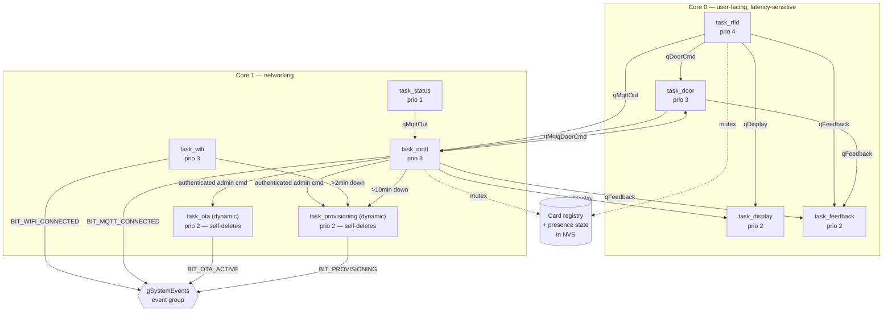
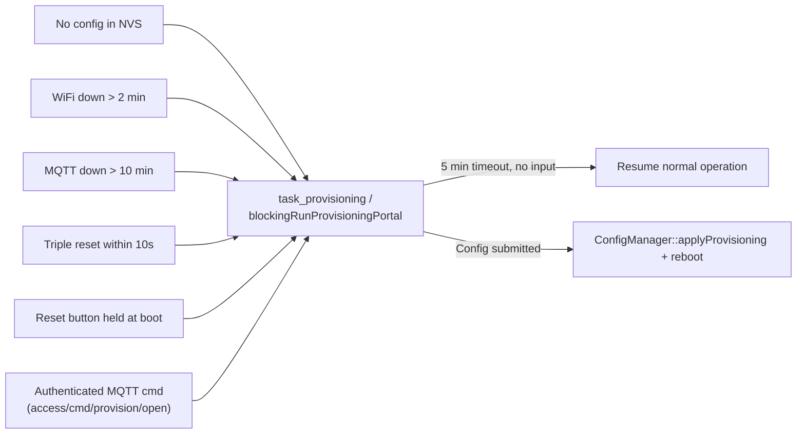

# NexEntry v2 — FreeRTOS Task Diagram

```mermaid
flowchart TB
    subgraph Core0["Core 0 — user-facing, latency-sensitive"]
        RFID[task_rfid<br/>prio 4]
        DOOR[task_door<br/>prio 3]
        DISP[task_display<br/>prio 2]
        FBK[task_feedback<br/>prio 2]
    end

    subgraph Core1["Core 1 — networking"]
        WIFI[task_wifi<br/>prio 3]
        MQTT[task_mqtt<br/>prio 3]
        STAT[task_status<br/>prio 1]
        OTA["task_ota (dynamic)<br/>prio 2 — self-deletes"]
        PROV["task_provisioning (dynamic)<br/>prio 2 — self-deletes"]
    end

    RFID -- qDisplay --> DISP
    RFID -- qFeedback --> FBK
    RFID -- qDoorCmd --> DOOR
    RFID -- qMqttOut --> MQTT

    DOOR -- qFeedback --> FBK
    DOOR -- qMqttOut --> MQTT

    MQTT -- qDoorCmd --> DOOR
    MQTT -- qDisplay --> DISP
    MQTT -- qFeedback --> FBK
    MQTT -- "authenticated admin cmd" --> OTA
    MQTT -- "authenticated admin cmd" --> PROV

    STAT -- qMqttOut --> MQTT

    RFID -. mutex .-> REG[(Card registry<br/>+ presence state<br/>in NVS)]
    MQTT -. mutex .-> REG

    WIFI -- "BIT_WIFI_CONNECTED" --> EVT{{gSystemEvents<br/>event group}}
    MQTT -- "BIT_MQTT_CONNECTED" --> EVT
    OTA -- "BIT_OTA_ACTIVE" --> EVT
    PROV -- "BIT_PROVISIONING" --> EVT
    WIFI -- ">2min down" --> PROV
    MQTT -- ">10min down" --> PROV
```

## Recovery-mode trigger paths (Req. #6)

```mermaid
flowchart LR
    A[No config in NVS] --> P[task_provisioning /\nblockingRunProvisioningPortal]
    B[WiFi down > 2 min] --> P
    C[MQTT down > 10 min] --> P
    D[Triple reset within 10s] --> P
    E[Reset button held at boot] --> P
    F["Authenticated MQTT cmd\n(access/cmd/provision/open)"] --> P
    P -->|"5 min timeout, no input"| N[Resume normal operation]
    P -->|"Config submitted"| S[ConfigManager::applyProvisioning + reboot]
```
