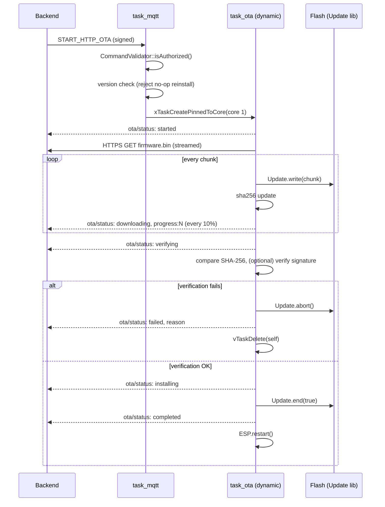

# NexEntry v2.1 — Secure HTTP OTA

WebOTA (the temporary browser-upload WebServer task) has been removed
completely. The device now **pulls** `firmware.bin` from a backend URL over
HTTPS in response to an authenticated MQTT command, verifies it, and
installs it. Same dev and prod flow — no more "WebOTA in dev, something
else in prod" split.

## Flow

```
Admin uploads firmware.bin to backend
        │
Backend stores it, computes SHA-256 (and signs it, optionally)
        │
Backend/dashboard publishes an authenticated MQTT command:
        │   access/cmd/ota/enable
        │   {"cmd":"START_HTTP_OTA","version":"2.2.0",
        │    "url":"https://server/firmware.bin","sha256":"...",
        │    "signature":"...","force":false,
        │    "ts":..., "nonce":"...", "sig":"..."}
        ▼
ESP32 mqtt task validates signature/nonce/timestamp (security/*)
        │
requestStartHttpOta() checks version isn't a no-op reinstall
        │
Creates dynamic task_ota (Core 1)
        │
HTTPS GET the url (WiFiClientSecure + HTTPClient), streamed
        │  → published: {"status":"downloading","progress":N}
        │
SHA-256 computed while streaming, compared to the command's sha256
        │  → published: {"status":"verifying"}
        │
(optional) signature checked against the digest — see ota_security.h
        │
Update.end(true) commits the new image
        │  → published: {"status":"installing"} then {"status":"completed"}
        │
ESP.restart()
```

On any failure at any stage: `Update.abort()`, publish
`{"status":"<reason>"}` to `access/ota/status`, publish a
`access/security/event` entry, delete the OTA task, resume normal
operation. Nothing about RFID/attendance/door/display is ever blocked by
this — OTA runs entirely on Core 1 in its own task.

## Task diagram



## MQTT OTA payload specification

**Command** — `access/cmd/ota/enable` (topic unchanged from earlier v2;
payload redefined for HTTP OTA):

```json
{
  "cmd": "START_HTTP_OTA",
  "version": "2.2.0",
  "url": "https://backend.example.com/firmware/2.2.0/firmware.bin",
  "sha256": "3a7bd3e2360a3d...64 hex chars",
  "signature": "",
  "force": false,
  "ts": 1732900000,
  "nonce": "a1b2c3d4e5f6a7b8",
  "sig": "hmac-sha256 over topic|ts|nonce|body — see security/auth.h"
}
```

| Field | Required | Notes |
|---|---|---|
| `cmd` | yes | Must be `"START_HTTP_OTA"` |
| `version` | yes | Rejected if equal to the running `FIRMWARE_VERSION` unless `force:true` |
| `url` | yes | Must be reachable over HTTPS; validated against the CA cert in `config/tls_cert.h` |
| `sha256` | recommended | 64 hex chars. If omitted, integrity checking is skipped (logged as a warning) |
| `signature` | optional | Hex-encoded signature over the SHA-256 digest — see `security/ota_security.h` for the (currently no-op, documented) verification hook |
| `force` | optional | Default `false`. Set `true` to reinstall the currently-running version |
| `ts`, `nonce`, `sig` | yes | Standard admin-command auth — see `security/auth.h`. `ts`/`nonce`/`sig` are this project's existing field names for what the brief calls timestamp/nonce/hmac; kept consistent with every other protected command rather than inventing a second scheme |

**Status events** — published to `access/ota/status`:

```json
{"status": "started", "progress": 0, "timestamp": 1732900001}
{"status": "downloading", "progress": 40, "timestamp": 1732900010}
{"status": "verifying", "progress": 100, "timestamp": 1732900030}
{"status": "installing", "progress": 100, "timestamp": 1732900031}
{"status": "completed", "progress": 100, "timestamp": 1732900032}
```

Failure example:
```json
{"status": "SHA-256 mismatch — firmware rejected", "timestamp": 1732900030}
```

`progress` is omitted for status values that don't have a meaningful
percentage (e.g. most failure reasons).

## Removed WebOTA components

| Removed | Was in |
|---|---|
| `WebServer` HTTP upload endpoint (`/`, `/update`) | `tasks/task_ota.cpp` (v2.0) |
| Browser HTML upload form | `tasks/task_ota.cpp` (v2.0) |
| `OtaSecurity::checkCredentials()` (Basic Auth check for the browser form) | `security/ota_security.*` (v2.0) |
| `#include <WebServer.h>` | `tasks/task_ota.cpp` (v2.0) |
| Any `ArduinoOTA` remnants | none found — already absent as of v2.0 |

**Kept, repurposed:** the OTA username/password fields in `ConfigManager`
(and the provisioning-portal fields for them) are no longer a browser Basic
Auth check — they're now sent as HTTP Basic Auth credentials on the
outbound `HTTPClient` request to your firmware backend, for backends that
want to gate who can download `firmware.bin`. No NVS schema change, no
portal change required.

## What stayed the same

- `Update` library (still used — now for streamed writes instead of
  chunked browser-upload writes).
- SHA-256 verification (`security/ota_security.*` — same hashing approach,
  now also exposes the digest for signature verification).
- `BIT_OTA_ACTIVE` event-group bit, `Display::otaActive()` LCD screen,
  dynamic-task-that-self-deletes pattern.
- Administrative command authentication (HMAC/nonce/timestamp/replay
  protection) — unchanged, reused as-is for the new payload shape.
